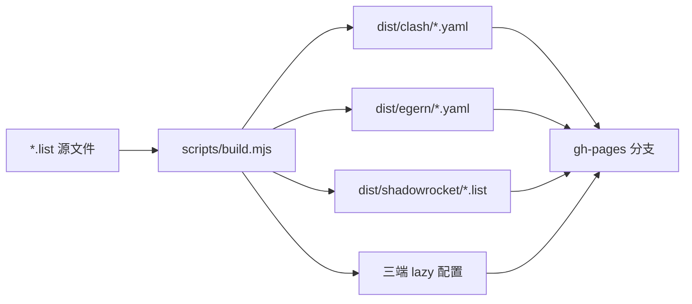

# Teakowa Rules

一套通过 **GitHub Actions 自动生成** 的 Clash / Egern / Shadowrocket 分流规则，附带**懒人配置**，填入机场订阅链接即可使用。

## 特性

- **一条命令生成三端规则**：维护一份 `.list` 源文件，自动输出 Clash rule-provider、Egern rule set、Shadowrocket rule set
- **懒人配置**：Clash / Egern / Shadowrocket 各提供一份完整配置文件，只需替换订阅链接
- **每日自动更新**：GitHub Actions 定时（每天 02:00 UTC）+ 源文件变更时自动重新构建并发布到 `gh-pages`
- 源规则去重、排序，格式自动转换

## 懒人配置（快速开始）

把下方 URL 粘贴到对应客户端即可导入，再填入你的机场订阅链接。

| 客户端 | 懒人配置地址 |
| ------ | ------------ |
| Clash (Premium/Meta) | `https://teakowa.github.io/Rules/clash/lazy.yaml` |
| Egern | `https://teakowa.github.io/Rules/egern/lazy.yaml` |
| Shadowrocket | `https://teakowa.github.io/Rules/shadowrocket/lazy.conf` |

### Clash

1. 下载 `clash/lazy.yaml`
2. 将 `proxy-providers` 中的 `url` 换成你的机场订阅链接（或改用 `proxies` 手动填节点）
3. 导入客户端即可，规则集每日自动更新

### Egern

1. 下载 `egern/lazy.yaml`
2. 将 `policy_groups` 中 `external.urls` 换成你的订阅链接
3. 导入客户端，规则集每日自动更新

### Shadowrocket

1. 下载 `shadowrocket/lazy.conf`
2. 在「订阅」中添加你的节点
3. 启用该配置即可，规则集每日自动更新

## 独立规则集

不想用懒人配置，也可以单独引用规则集：

| 规则集 | Clash | Egern | Shadowrocket |
| ------ | ----- | ----- | ------------ |
| 广告拦截 (REJECT) | `clash/block.yaml` / `clash/reject.yaml` | `egern/Block.yaml` / `egern/Reject.yaml` | `shadowrocket/block.list` / `shadowrocket/reject.list` |
| 走代理 (PROXY) | `clash/proxy.yaml` | `egern/Proxy.yaml` | `shadowrocket/proxy.list` |
| 直连 (DIRECT) | `clash/direct.yaml` | `egern/Direct.yaml` | `shadowrocket/direct.list` |
| UltraMobile 专线 (DIRECT) | `clash/ultramobile.yaml` | `egern/UltraMobile.yaml` | `shadowrocket/ultramobile.list` |

完整 URL 前缀：`https://teakowa.github.io/Rules/`，例如
`https://teakowa.github.io/Rules/clash/block.yaml`。

## 源文件

仓库根目录下的 `.list` 文件是唯一维护入口，格式为 Surge/Shadowrocket 规则：

```
DOMAIN-SUFFIX,example.com
DOMAIN,example.com
IP-CIDR,1.2.3.4/32,no-resolve
```

| 文件 | 用途 |
| ---- | ---- |
| `block.list` | 广告 / 追踪拦截 |
| `Reject.list` | 拒绝连接 |
| `proxy.list` | 走代理 |
| `Direct.list` | 直连 |
| `UltraMobile.list` | Ultra Mobile 运营商专线 |

> `PROCESS-NAME` 规则仅在 Shadowrocket 输出中保留，Clash / Egern 规则集会自动剔除不兼容类型。

## 本地构建

```bash
npm run build
# 或
node scripts/build.mjs
```

产物输出到 `dist/` 目录。

## 工作原理



- **触发**：`push` 到 `master`（仅影响规则文件时）或定时任务
- **发布**：`peaceiris/actions-gh-pages` 将 `dist/` 推送到 `gh-pages` 分支
- **访问**：`https://teakowa.github.io/Rules/`（GitHub Pages）

> 仓库设置中需启用 **Settings → Pages → Deploy from a branch → gh-pages**。

## License

[MIT](LICENSE)
