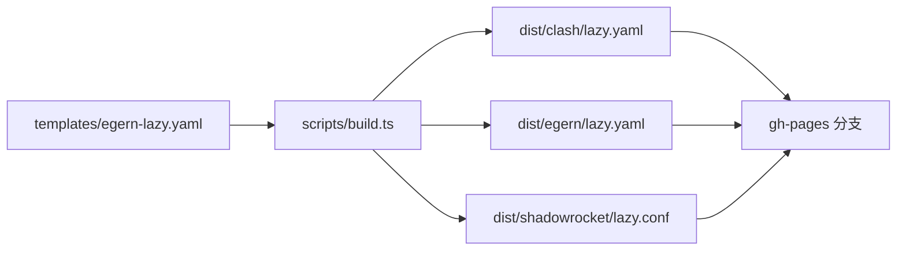

# Teakowa Rules

一套通过 **GitHub Actions 自动生成** 的 Clash / Egern / Shadowrocket 分流规则，附带**懒人配置**，填入机场订阅链接即可使用。

## 特性

- **模板驱动**：维护一份 Egern 配置模板 `templates/egern-lazy.yaml`，自动派生 Clash / Egern / Shadowrocket 三端懒人配置
- **懒人配置**：Clash / Egern / Shadowrocket 各提供一份完整配置文件，只需替换订阅链接
- **每日自动更新**：GitHub Actions 定时（每天 02:00 UTC）+ 模板变更时自动重新构建并发布到 `gh-pages`

## 懒人配置（快速开始）

把下方 URL 粘贴到对应客户端即可导入，再填入你的机场订阅链接。

| 客户端 | 懒人配置地址 |
| ------ | ------------ |
| Clash (Premium/Meta) | `https://teakowa.github.io/Rules/clash/lazy.yaml` |
| Egern | `https://teakowa.github.io/Rules/egern/lazy.yaml` |
| Shadowrocket | `https://teakowa.github.io/Rules/shadowrocket/lazy.conf` |

### Clash

1. 下载 `clash/lazy.yaml`
2. 将 `proxy-providers` 中的 `url` 换成你的机场订阅链接
3. 导入客户端即可，规则集每日自动更新

### Egern

1. 下载 `egern/lazy.yaml`
2. 将 `policy_groups` 中 `external.urls` 换成你的订阅链接
3. 导入客户端，规则集每日自动更新

### Shadowrocket

1. 下载 `shadowrocket/lazy.conf`
2. 在「订阅」中添加你的节点（配置内已内置两条订阅占位，可改为你的链接）
3. 启用该配置即可

## 模板

`templates/egern-lazy.yaml` 是唯一的规则维护入口，即 Egern 懒人配置本体：

- `policy_groups`：代理组（`select` / `smart` / `auto_test` / `external` 订阅组），构建时转换为 Clash `proxy-groups` 与 Shadowrocket `[Proxy Group]`
- `rules`：分流规则，构建时转换为 Clash / Shadowrocket 规则与 rule-provider / RULE-SET
- `external` 订阅组中的 `urls` 使用占位符 `https://your-subscribe-url/sub`，构建时原样保留

> `and` / `not` / `protocol` 等 Egern 专有规则无法表达为 Clash / Shadowrocket 规则，构建时会跳过并打印警告，不影响 Egern 端使用。

## 本地构建

```bash
pnpm typecheck
pnpm build
```

产物输出到 `dist/` 目录：

- `dist/clash/lazy.yaml`
- `dist/egern/lazy.yaml`
- `dist/shadowrocket/lazy.conf`

## 工作原理



- **触发**：`push` 到 `master`（仅影响 `templates/`、`scripts/` 时）或定时任务
- **发布**：`peaceiris/actions-gh-pages` 将 `dist/` 推送到 `gh-pages` 分支
- **访问**：`https://teakowa.github.io/Rules/`（GitHub Pages）

> 仓库设置中需启用 **Settings → Pages → Deploy from a branch → gh-pages**。

## License

[MIT](LICENSE)
